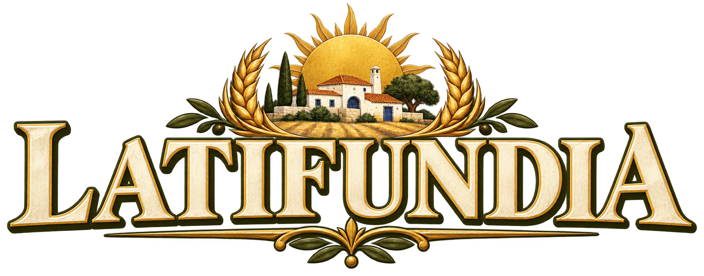

# Latifundia

**Uma aldeia no Alentejo. Uma vila construída por ti.**  
**A village in Alentejo. A town built by you.**

[Português](#português) · [English](#english)

---

## Português

### Sobre o jogo

**Latifundia** é um jogo de construção e gestão de cidades inspirado em **Caesar III**, passado no Alentejo. Entre casas caiadas, telhados de terracota e searas douradas, constrói uma aldeia e gere os recursos necessários ao seu crescimento.

Desenvolvido em **HTML, CSS e JavaScript**, funciona no navegador, sem instalação de dependências ou processo de compilação.

**Estado:** protótipo jogável em desenvolvimento. A interface do jogo está atualmente em português; este README está disponível em português e inglês.

### O que já podes fazer

- Construir num mapa isométrico de 12 × 12 terrenos.
- Ligar casas e serviços à praça inicial através de estradas.
- Produzir alimentos em searas e obter receitas com impostos e moinhos.
- Abastecer casas através de mercados próximos para atrair habitantes.
- Construir uma igreja e alcançar o primeiro marco de desenvolvimento.
- Demolir construções com reembolso parcial e reorganizar a aldeia.
- Continuar a jogar sem limite de estações.
- Guardar automaticamente o progresso no navegador, quando disponível.

A casa alentejana, a igreja e os terrenos usam os ativos PNG do projeto. Mercados, moinhos e estradas ainda têm gráficos provisórios desenhados em Canvas.

### Como executar

1. Descarrega ou clona o repositório.
2. Se descarregaste um ZIP, extrai-o primeiro.
3. Mantém `index.html`, `main.js`, `style.css` e a pasta `assets` juntos.
4. Abre `index.html` num navegador moderno.

Se tiveres a edição autónoma `Latifundia-v3-ativos.html`, basta abrir esse ficheiro: as imagens, os estilos e o código estão incorporados.

### Como jogar

Começas com **140 moedas, 30 alimentos e 4 habitantes**, uma casa, uma seara, um mercado e um pequeno conjunto de estradas.

1. Expande as estradas a partir da **praça dourada**. As ligações contam pelos lados, não pelas diagonais.
2. Constrói casas junto a estradas ligadas à praça e perto de mercados também ligados.
3. Acrescenta searas para acompanhar o consumo da população.
4. Seleciona **Próxima estação** para colher, cobrar impostos e atualizar a população.
5. Alcança **24 habitantes, uma igreja ligada à praça e 20 alimentos**. Este marco não termina o jogo.

| Construção | Custo | Função |
| --- | ---: | --- |
| Estrada | 2 moedas | Liga a aldeia à praça inicial |
| Casa alentejana | 30 moedas | Acolhe até 4 habitantes |
| Seara | 25 moedas | Produz 8 alimentos por estação, quando ligada |
| Mercado | 40 moedas | Abastece casas a até 4 passos na grelha |
| Moinho | 60 moedas | Gera 8 moedas por estação, quando ligado |
| Igreja | 120 moedas | Ocupa 2 × 2 terrenos e integra o primeiro marco |

A população consome **1 alimento por cada 2 habitantes**, arredondado para cima, e gera **1 moeda de imposto por habitante**, por estação. Podem chegar até 2 habitantes por estação, desde que exista capacidade abastecida e restem pelo menos 2 alimentos após o consumo. A falta de comida ou de serviços provoca partidas.

Os mercados usam uma distância simplificada na grelha, sem diagonais; ainda não existem habitantes a transportar mercadorias pelas estradas. Os pontos vermelhos assinalam edifícios sem ligação à praça. Não é possível construir sobre água.

**Demolir** devolve metade do custo, arredondado para baixo. Demolir casas pode expulsar habitantes; a praça inicial está protegida.

### Controlos e gravação

- **Rato ou toque:** escolhe uma ferramenta e um terreno.
- **Teclado:** com o mapa focado, usa as setas para selecionar e `Enter` ou `Espaço` para aplicar a ferramenta.
- **Nova aldeia:** reinicia o progresso após confirmação.

A gravação usa `localStorage`, sem conta ou sincronização entre dispositivos. A disponibilidade depende das definições do navegador; abrir ficheiros locais, mudar de navegador ou limpar os dados pode afetar o progresso guardado.

### Estrutura do projeto

| Caminho | Conteúdo |
| --- | --- |
| `index.html` | Interface e estrutura da página |
| `style.css` | Estilos e adaptação a diferentes ecrãs |
| `main.js` | Simulação, controlos, gravação e desenho em Canvas |
| `assets/logo.png` | Logo de Latifundia |
| `assets/casa.png` | Casa alentejana |
| `assets/catedral.png` | Igreja |
| `assets/terreno_base.png` | Terreno base |
| `assets/terreno_ceara.png` | Terreno de seara |

### Próximos passos possíveis

Ideias para desenvolvimento, **ainda não implementadas**:

- Habitantes e trabalhadores a percorrer as estradas.
- Evolução das casas consoante os serviços disponíveis.
- Emprego, cadeias de produção e comércio.
- Mais serviços, construções e mapas.
- Gráficos próprios para mercados, moinhos e estradas.
- Interface em inglês.

Para reportar um problema, abre uma issue com os passos para o reproduzir, o navegador utilizado e, se possível, uma captura de ecrã.

---

## English

### About the game

**Latifundia** is a city-building and management game inspired by **Caesar III**, set in Portugal’s Alentejo region. Among whitewashed houses, terracotta roofs, and golden wheat fields, build a village and manage the resources it needs to grow.

Built with **HTML, CSS, and JavaScript**, it runs in your browser without installing dependencies or running a build process.

**Status:** playable prototype under development. The game interface is currently in Portuguese; this README is available in Portuguese and English.

### Current features

- Build on a 12 × 12 isometric map.
- Connect homes and services to the starting square through roads.
- Produce food on farms and earn money through taxes and windmills.
- Supply homes through nearby markets to attract residents.
- Build a church and reach the first development milestone.
- Demolish buildings for a partial refund and reorganize your village.
- Keep playing without a season limit.
- Automatically save progress in your browser, when available.

The Alentejo house, church, and terrain use the project’s PNG assets. Markets, windmills, and roads still use placeholder Canvas graphics.

### Running the game

1. Download or clone the repository.
2. If you downloaded a ZIP, extract it first.
3. Keep `index.html`, `main.js`, `style.css`, and the `assets` folder together.
4. Open `index.html` in a modern browser.

If you have the standalone `Latifundia-v3-ativos.html` edition, simply open that file: images, styles, and code are embedded.

### How to play

You start with **140 coins, 30 food, and 4 residents**, a house, a farm, a market, and a short road network.

1. Extend roads from the **golden square**. Roads connect along their edges, not diagonally.
2. Build houses beside connected roads and near connected markets.
3. Add farms to keep up with food consumption.
4. Select **Próxima estação** (“Next season”) to harvest food, collect taxes, and update the population.
5. Reach **24 residents, a church connected to the square, and 20 food**. This milestone does not end the game.

| Building | Cost | Purpose |
| --- | ---: | --- |
| Road | 2 coins | Connects the village to the starting square |
| Alentejo house | 30 coins | Accommodates up to 4 residents |
| Farm | 25 coins | Produces 8 food per season when connected |
| Market | 40 coins | Supplies homes within 4 grid steps |
| Windmill | 60 coins | Generates 8 coins per season when connected |
| Church | 120 coins | Occupies 2 × 2 tiles and contributes to the first milestone |

Each season, the population consumes **1 food per 2 residents**, rounded up, and generates **1 tax coin per resident**. Up to 2 residents can arrive each season if supplied housing is available and at least 2 food remain after consumption. Food shortages or missing services cause residents to leave.

Markets use simplified grid distance without diagonals; residents do not yet carry goods along roads. Red dots mark buildings disconnected from the square. Building on water is not allowed.

**Demolir** (“Demolish”) refunds half the cost, rounded down. Demolishing houses can displace residents; the starting square is protected.

### Controls and saving

- **Mouse or touch:** select a tool and a tile.
- **Keyboard:** focus the map, use the arrow keys to select a tile, and press `Enter` or `Space` to apply the tool.
- **Nova aldeia** (“New village”): resets progress after confirmation.

Saving uses `localStorage`, with no account or cross-device synchronization. Availability depends on browser settings; opening local files, switching browsers, or clearing browser data may affect saved progress.

### Project structure

| Path | Contents |
| --- | --- |
| `index.html` | Interface and page structure |
| `style.css` | Styling and responsive layout |
| `main.js` | Simulation, controls, saving, and Canvas rendering |
| `assets/logo.png` | Latifundia logo |
| `assets/casa.png` | Alentejo house |
| `assets/catedral.png` | Church |
| `assets/terreno_base.png` | Base terrain |
| `assets/terreno_ceara.png` | Wheat field terrain |

### Possible next steps

Development ideas, **not yet implemented**:

- Residents and workers walking along roads.
- Housing evolution based on available services.
- Employment, production chains, and trade.
- More services, buildings, and maps.
- Dedicated artwork for markets, windmills, and roads.
- An English-language interface.

To report a problem, open an issue with reproduction steps, your browser, and a screenshot if possible.
